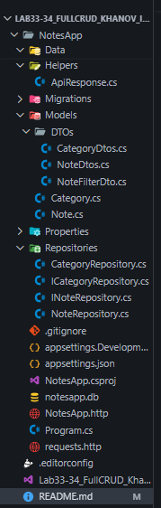

## Лабораторная работа №33-34. Полноценный CRUD с базой данных

**Студент:** Ханов В.В.

**Группа:** ИСП-231

**Дата выполнения:** 05.05.2026

---

### Описание проекта

NotesApp — это API для работы с заметками. В приложении есть категории и заметки. Каждая заметка относится к одной категории. Можно создавать, редактировать и удалять категории и заметки. Заметки можно закреплять вверху списка или архивировать. Также есть поиск по заметкам, фильтрация по категории и приоритету, сортировка и постраничный вывод. Данные хранятся в SQLite.

---

### Структура проекта

### Таблица всех маршрутов

| Метод    | URL                              | Описание                              | Коды ответа          |
|----------|----------------------------------|---------------------------------------|----------------------|
| GET      | /api/categories                  | Все категории с кол-вом заметок       | 200                  |
| GET      | /api/categories/{id}             | Одна категория                        | 200, 404             |
| GET      | /api/categories/{id}/notes       | Категория с заметками                 | 200, 404             |
| POST     | /api/categories                  | Создать категорию                     | 201, 400             |
| PUT      | /api/categories/{id}             | Обновить категорию                    | 200, 400, 404        |
| DELETE   | /api/categories/{id}             | Удалить категорию                     | 204, 400, 404        |
| GET      | /api/notes                       | Все заметки с фильтрами               | 200                  |
| GET      | /api/notes/{id}                  | Одна заметка                          | 200, 404             |
| POST     | /api/notes                       | Создать заметку                       | 201, 400             |
| PUT      | /api/notes/{id}                  | Обновить заметку                      | 200, 400, 404        |
| PATCH    | /api/notes/{id}/pin              | Закрепить / открепить                 | 200, 404             |
| PATCH    | /api/notes/{id}/archive          | Архивировать / восстановить           | 200, 404             |
| DELETE   | /api/notes/{id}                  | Удалить заметку                       | 204, 404             |

---

### Описание паттерна Repository

Repository — это паттерн проектирования, который создаёт прослойку между контроллерами и базой данных. Вся логика работы с данными выносится в отдельные классы-репозитории.

##### Зачем он нужен

1. **Разделение ответственности** — контроллер занимается только обработкой HTTP-запросов, а репозиторий — работой с базой данных.

2. **Переиспользование кода** — один и тот же метод репозитория можно вызывать из разных контроллеров.

3. **Упрощение тестирования** — репозиторий легко подменить на тестовую версию, не подключаясь к реальной базе данных.

4. **Смена базы данных** — чтобы перейти с SQLite на PostgreSQL, достаточно изменить реализацию репозитория, не трогая контроллеры.

5. **Централизованная логика** — например, автоматическое обновление поля UpdatedAt при сохранении заметки прописывается один раз в репозитории.